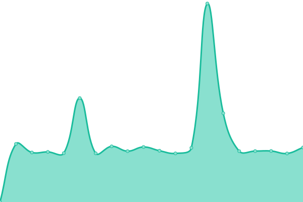
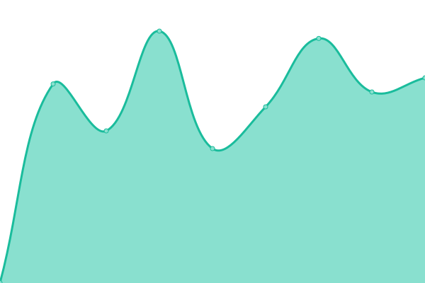

# [📈 Онлайн статус](https://haku-host.github.io/side-monitor/): <!--live status--> **🟧 Partial outage**

Этот репозиторий - инстанция [Upptime](https://github.com/upptime/upptime), запущенная для внешнего мониторинга состояния сервисов [haku.host](https://haku.host/).  
Нужно это добро для независимого обнаружения падений, служит дополнением [основному сайту статуса](https://status.haku.host/).

<!--start: status pages-->
<!-- This summary is generated by Upptime (https://github.com/upptime/upptime) -->
<!-- Do not edit this manually, your changes will be overwritten -->
<!-- prettier-ignore -->
| URL | Status | History | Response Time | Uptime |
| --- | ------ | ------- | ------------- | ------ |
|  G2 Network | 🟥 Down | [g2-network.yml](https://github.com/haku-host/side-monitor/commits/HEAD/history/g2-network.yml) | 

 0ms
     
 | 

<a href="https://haku-host.github.io/side-monitor/history/g2-network">0.00%</a>
    

|  [MSK1 HTTPS](https://msk1.haku.host) | 🟩 Up | [msk-1-https.yml](https://github.com/haku-host/side-monitor/commits/HEAD/history/msk-1-https.yml) | 

 1559ms
     
 | 

<a href="https://haku-host.github.io/side-monitor/history/msk-1-https">99.30%</a>
    

|  [MSK2 HTTPS](https://msk2.haku.host) | 🟩 Up | [msk-2-https.yml](https://github.com/haku-host/side-monitor/commits/HEAD/history/msk-2-https.yml) | 

 1550ms
     
 | 

<a href="https://haku-host.github.io/side-monitor/history/msk-2-https">99.56%</a>
    

|  [MSK3 HTTPS](https://msk3.haku.host) | 🟩 Up | [msk-3-https.yml](https://github.com/haku-host/side-monitor/commits/HEAD/history/msk-3-https.yml) | 

 1595ms
     
 | 

<a href="https://haku-host.github.io/side-monitor/history/msk-3-https">99.40%</a>
    

|  [WebSite](https://haku.host) | 🟥 Down | [web-site.yml](https://github.com/haku-host/side-monitor/commits/HEAD/history/web-site.yml) | 

 1866ms
     
 | 

<a href="https://haku-host.github.io/side-monitor/history/web-site">98.90%</a>
    

|  [Panel](https://my.haku.host) | 🟥 Down | [panel.yml](https://github.com/haku-host/side-monitor/commits/HEAD/history/panel.yml) | 

 554ms
     
 | 

<a href="https://haku-host.github.io/side-monitor/history/panel">98.91%</a>
    

|  HakuPay Backend | 🟥 Down | [haku-pay-backend.yml](https://github.com/haku-host/side-monitor/commits/HEAD/history/haku-pay-backend.yml) | 

 350ms
     
 | 

<a href="https://haku-host.github.io/side-monitor/history/haku-pay-backend">98.92%</a>
    

|  [Uptime Kuma](https://status.haku.host) | 🟥 Down | [uptime-kuma.yml](https://github.com/haku-host/side-monitor/commits/HEAD/history/uptime-kuma.yml) | 

 558ms
     
 | 

<a href="https://haku-host.github.io/side-monitor/history/uptime-kuma">98.92%</a>
    

|  [Wiki](https://wiki.haku.host) | 🟥 Down | [wiki.yml](https://github.com/haku-host/side-monitor/commits/HEAD/history/wiki.yml) | 

 693ms
     
 | 

<a href="https://haku-host.github.io/side-monitor/history/wiki">99.19%</a>
    

|  [mirror.haku.su](https://archlinux.gay) | 🟥 Down | [mirror-haku-su.yml](https://github.com/haku-host/side-monitor/commits/HEAD/history/mirror-haku-su.yml) | 

 935ms
     
 | 

<a href="https://haku-host.github.io/side-monitor/history/mirror-haku-su">99.20%</a>
    

<!--end: status pages-->

[**Внутренний монитор →**](https://status.haku.host)  
[**Внешний монитор →**](https://haku-host.github.io/side-monitor/)

## 📄 Лицензия

- Powered by: [Upptime](https://github.com/upptime/upptime)
- Code: [MIT](./LICENSE) © [Anand Chowdhary](https://anandchowdhary.com), supported by [Pabio](https://pabio.com)
- Data in the `./history` directory: [Open Database License](https://opendatacommons.org/licenses/odbl/1-0/)
