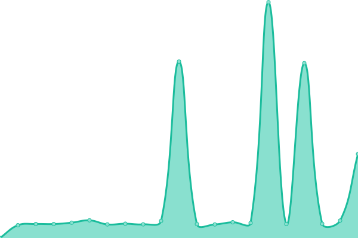
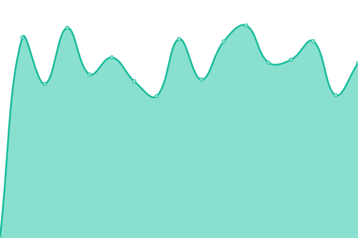
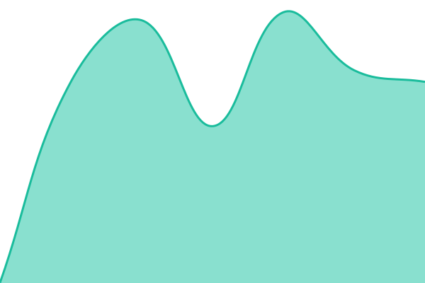
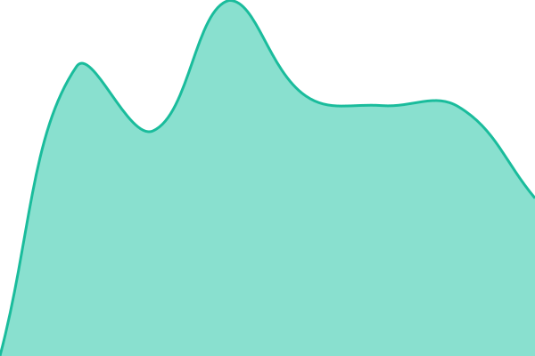

# [📈 Онлайн статус](https://haku-host.github.io/side-monitor/): <!--live status--> **🟧 Partial outage**

Этот репозиторий - инстанция [Upptime](https://github.com/upptime/upptime), запущенная для внешнего мониторинга состояния сервисов [haku.host](https://haku.host/).  
Нужно это добро для независимого обнаружения падений, служит дополнением [основному сайту статуса](https://status.haku.host/).

<!--start: status pages-->
<!-- This summary is generated by Upptime (https://github.com/upptime/upptime) -->
<!-- Do not edit this manually, your changes will be overwritten -->
<!-- prettier-ignore -->
| URL | Status | History | Response Time | Uptime |
| --- | ------ | ------- | ------------- | ------ |
|  [MSK1 HTTPS (Pterodactyl Xeon)](https://msk1.haku.host) | 🟥 Down | [msk-1-https-pterodactyl-xeon.yml](https://github.com/haku-host/side-monitor/commits/HEAD/history/msk-1-https-pterodactyl-xeon.yml) | 

 0ms
     
 | 

<a href="https://haku-host.github.io/side-monitor/history/msk-1-https-pterodactyl-xeon">0.00%</a>
    

|  [MSK2 HTTPS (Pterodactyl Xeon)](https://msk2.haku.host) | 🟥 Down | [msk-2-https-pterodactyl-xeon.yml](https://github.com/haku-host/side-monitor/commits/HEAD/history/msk-2-https-pterodactyl-xeon.yml) | 

 0ms
     
 | 

<a href="https://haku-host.github.io/side-monitor/history/msk-2-https-pterodactyl-xeon">0.00%</a>
    

|  [MSK3 HTTPS (Pterodactyl Ryzen)](https://msk3.haku.host) | 🟥 Down | [msk-3-https-pterodactyl-ryzen.yml](https://github.com/haku-host/side-monitor/commits/HEAD/history/msk-3-https-pterodactyl-ryzen.yml) | 

 0ms
     
 | 

<a href="https://haku-host.github.io/side-monitor/history/msk-3-https-pterodactyl-ryzen">0.00%</a>
    

|  [MSK4 HTTPS (Internal services)](https://haku.host) | 🟩 Up | [msk-4-https-internal-services.yml](https://github.com/haku-host/side-monitor/commits/HEAD/history/msk-4-https-internal-services.yml) | 

 1296ms
     
 | 

<a href="https://haku-host.github.io/side-monitor/history/msk-4-https-internal-services">100.00%</a>
    

|  MSK5 HTTPS (VDS Xeon) | 🟩 Up | [msk-5-https-vds-xeon.yml](https://github.com/haku-host/side-monitor/commits/HEAD/history/msk-5-https-vds-xeon.yml) | 

 955ms
     
 | 

<a href="https://haku-host.github.io/side-monitor/history/msk-5-https-vds-xeon">100.00%</a>
    

|  [Billing](https://haku.host) | 🟩 Up | [billing.yml](https://github.com/haku-host/side-monitor/commits/HEAD/history/billing.yml) | 

 1233ms
     
 | 

<a href="https://haku-host.github.io/side-monitor/history/billing">100.00%</a>
    

|  [Pterodactyl](https://my.haku.host) | 🟥 Down | [pterodactyl.yml](https://github.com/haku-host/side-monitor/commits/HEAD/history/pterodactyl.yml) | 

 0ms
     
 | 

<a href="https://haku-host.github.io/side-monitor/history/pterodactyl">0.00%</a>
    

|  [HakuStack](https://stack.haku.host) | 🟩 Up | [haku-stack.yml](https://github.com/haku-host/side-monitor/commits/HEAD/history/haku-stack.yml) | 

 1806ms
     
 | 

<a href="https://haku-host.github.io/side-monitor/history/haku-stack">100.00%</a>
    

|  HakuPay Backend | 🟩 Up | [haku-pay-backend.yml](https://github.com/haku-host/side-monitor/commits/HEAD/history/haku-pay-backend.yml) | 

 788ms
     
 | 

<a href="https://haku-host.github.io/side-monitor/history/haku-pay-backend">100.00%</a>
    

|  [Graphana](https://status.haku.host/public-dashboards/605083e175e849918ade2240b60db260) | 🟩 Up | [graphana.yml](https://github.com/haku-host/side-monitor/commits/HEAD/history/graphana.yml) | 

 870ms
     
 | 

<a href="https://haku-host.github.io/side-monitor/history/graphana">100.00%</a>
    

|  [Uptime Kuma](https://status.haku.host) | 🟩 Up | [uptime-kuma.yml](https://github.com/haku-host/side-monitor/commits/HEAD/history/uptime-kuma.yml) | 

 1671ms
     
 | 

<a href="https://haku-host.github.io/side-monitor/history/uptime-kuma">100.00%</a>
    

|  [Wiki](https://wiki.haku.host) | 🟩 Up | [wiki.yml](https://github.com/haku-host/side-monitor/commits/HEAD/history/wiki.yml) | 

 1073ms
     
 | 

<a href="https://haku-host.github.io/side-monitor/history/wiki">100.00%</a>
    

|  [archlinux.gay](https://archlinux.gay) | 🟩 Up | [archlinux-gay.yml](https://github.com/haku-host/side-monitor/commits/HEAD/history/archlinux-gay.yml) | 

 1224ms
     
 | 

<a href="https://haku-host.github.io/side-monitor/history/archlinux-gay">100.00%</a>
    

<!--end: status pages-->

[**Внутренний монитор →**](https://status.haku.host)  
[**Внешний монитор →**](https://haku-host.github.io/side-monitor/)

## 📄 Лицензия

- Powered by: [Upptime](https://github.com/upptime/upptime)
- Code: [MIT](./LICENSE) © [Anand Chowdhary](https://anandchowdhary.com), supported by [Pabio](https://pabio.com)
- Data in the `./history` directory: [Open Database License](https://opendatacommons.org/licenses/odbl/1-0/)
